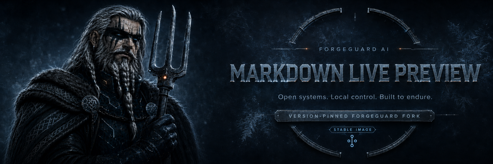
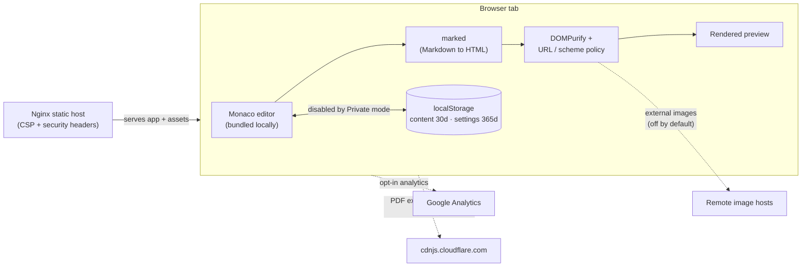

<div align="center">
  

<br>

<a href="./docs/site/index.md">
  
</a>
<a href="https://github.com/orgs/forgeguard-ai/packages?repo_name=markdown-live-preview">
  
</a>
<a href="./docs/site/deployment/kubernetes.md">
  
</a>
<a href="./SECURITY.md">
  
</a>
<a href="./LICENSE">
  
</a>

**A privacy-conscious, browser-only Markdown editor with live preview, packaged by ForgeGuard AI as a self-hostable container and Helm chart.**

[Quick start](#quick-start) ·
[Documentation](./docs/site/index.md) ·
[Deployment](./docs/site/deployment/container.md) ·
[Security](./SECURITY.md) ·
[Support](https://github.com/forgeguard-ai/markdown-live-preview/issues)

</div>

> [!IMPORTANT]
> **ForgeGuard maintained fork of [`tanabe/markdown-live-preview`](https://github.com/tanabe/markdown-live-preview).**
> This distribution tracks tagged upstream releases and adds privacy-conscious defaults, local dependency bundling, and ForgeGuard container/Helm artifacts.
>
> [ForgeGuard changes](./docs/site/fork/forgeguard-changes.md) · [Compatibility](./docs/site/fork/compatibility.md) · [Upstream](https://github.com/tanabe/markdown-live-preview)

## Overview

Markdown Live Preview is a small, entirely client-side web tool: you type Markdown on the
left and see the rendered HTML on the right. There is no backend, no account, and no document
upload — the editor, parser, and preview all run in your browser tab.

This repository is a **maintained fork**. Upstream [`tanabe/markdown-live-preview`](https://github.com/tanabe/markdown-live-preview)
owns the original application and its identity. ForgeGuard AI packages that application for
self-hosting and hardens its default privacy and security behavior: the Monaco editor is
bundled from local dependencies instead of a runtime CDN, analytics is opt-in, remote images
are blocked by default, rendered links and images pass through a strict URL policy, browser
persistence is bounded, and the static container ships with a restrictive Content Security
Policy and security headers.

It is intended for anyone who wants a Markdown preview tool they can run on their own
infrastructure — locally, in Docker, or on Kubernetes — without sending content to a
third-party service.

## Key capabilities

| Capability | What it provides |
|---|---|
| Browser-only rendering | Editing, parsing (`marked`), and sanitizing (`DOMPurify`) all run in the tab; no server processes your content. |
| Local Monaco bundling | The Monaco editor is bundled from project dependencies, not loaded from a third-party runtime CDN. |
| Opt-in analytics | Google Analytics is disabled by default and loads only after you enable the Analytics toggle. |
| Private mode | Suppresses saving editor content to browser storage for the session. |
| Remote-image control | External (cross-origin) images are blocked by default; an explicit toggle enables them with `no-referrer` + lazy loading. |
| URL scheme policy | Rendered links are limited to safe schemes and receive `rel="noopener noreferrer nofollow"`. |
| Bounded persistence | Editor content is retained for 30 days and settings for 365 days in `localStorage`, not indefinitely. |
| Hardened container | The Nginx image sets a strict CSP plus clickjacking, MIME, referrer, and permissions headers. |
| Self-host artifacts | Published GHCR container image and an OCI Helm chart with a non-root, read-only security posture. |

## Quick start

Run the published ForgeGuard image and open it in a browser:

```bash
docker run --rm -p 8080:80 ghcr.io/forgeguard-ai/markdown-live-preview:latest
```

Verify the container is serving:

```bash
curl --fail http://localhost:8080/
```

Then open <http://localhost:8080> and start typing Markdown. See the
[deployment documentation](./docs/site/deployment/container.md) for building from source,
Docker Compose, Portainer, and Kubernetes.

## Deployment options

| Method | Intended use | Documentation |
|---|---|---|
| Container | Local use and single-service hosting | [Container](./docs/site/deployment/container.md) |
| Docker Compose | Durable single-host operation | [Compose & Portainer](./docs/site/deployment/compose-and-portainer.md) |
| Portainer | Managed remote Docker environments | [Compose & Portainer](./docs/site/deployment/compose-and-portainer.md) |
| Kubernetes (Helm) | Cluster deployment | [Kubernetes](./docs/site/deployment/kubernetes.md) |

## Architecture

Everything runs inside the browser tab. The only content that ever leaves your browser does so
through explicitly opt-in features (analytics) or an operator-provided network, and the PDF
export library is the one script fetched from a third-party CDN at runtime.



The dotted paths are the app's trust boundaries: remote image loading, analytics, and the PDF
export library are the only routes to third parties, and the first two are off until you enable
them. See [Security and privacy](./docs/site/operations/security-and-privacy.md) for the exact
Content Security Policy and headers.

## Documentation

- [Getting started](./docs/site/getting-started/quickstart.md)
- [Usage](./docs/site/usage/editor-and-preview.md)
- [Privacy controls](./docs/site/usage/privacy-controls.md)
- [Deployment](./docs/site/deployment/container.md)
- [Operations](./docs/site/operations/security-and-privacy.md)
- [Reference](./docs/site/reference/build-and-configuration.md)
- [Troubleshooting](./docs/site/troubleshooting/common-issues.md)
- [The ForgeGuard fork](./docs/site/fork/forgeguard-changes.md)

## Compatibility and release policy

This fork tracks upstream **tagged releases** and reapplies the ForgeGuard privacy, container,
and Helm changes on top. Container images publish a rolling `latest` tag plus immutable
`sha-<commit>` tags; the Helm chart is versioned independently (`0.1.1` at time of writing).
For persistent deployments, pin an immutable `sha-*` image tag and a specific chart version.
Container images are currently built for `linux/amd64` only. See
[fork compatibility](./docs/site/fork/compatibility.md) for the upstream base and known
divergences (including upstream-only Mermaid rendering, which this fork does **not** include).

## Support

Use [GitHub Issues](https://github.com/forgeguard-ai/markdown-live-preview/issues) for problems
with the ForgeGuard container, Helm chart, or privacy/security defaults. Questions about core
Markdown editing behavior that also occur on upstream builds belong with the
[upstream project](https://github.com/tanabe/markdown-live-preview). See [SUPPORT.md](./SUPPORT.md)
for how to route an issue.

## Security

Do not report suspected vulnerabilities through a public issue. Follow the instructions in
[SECURITY.md](./SECURITY.md). Sanitized rendering reduces risk but is not a complete isolation
boundary for hostile Markdown or browser vulnerabilities; see
[Security and privacy](./docs/site/operations/security-and-privacy.md) for the limits.

## Contributing

Contributions are welcome. Review [CONTRIBUTING.md](./CONTRIBUTING.md) before opening a pull
request. Development setup and maintainer procedures are documented under
[`docs/maintainers/`](./docs/maintainers/).

## License and attribution

This project is distributed under the [MIT License](./LICENSE), © 2020 Hideaki Tanabe.

Markdown Live Preview is created and maintained upstream by
[Hideaki Tanabe](https://github.com/tanabe/markdown-live-preview) and remains licensed under
its original MIT terms with its original copyright notice preserved. ForgeGuard AI maintains
this fork's packaging and privacy/security changes, which are identified in the repository
history and in [ForgeGuard changes](./docs/site/fork/forgeguard-changes.md). ForgeGuard is not
affiliated with or endorsed by the upstream project, and this fork does not imply upstream
endorsement.
